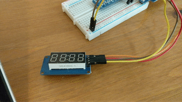
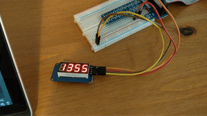

# Generic TM1637 GPIO Driver

Zero-dependency generic GPIO driver for the TM1637 micro controller, primarily for educational purpose. 
It is used in the 4-digit 7-segment display by AZ-Delivery [(Link)](https://www.az-delivery.de/products/4-digit-display).
Generic means that it is not dependent on a specific GPIO interface. You can choose the GPIO 
interface/library on your own. If you activate the crate feature `gpio-api-wiringpi` then you can easily
use wiring Pi. But you can also set it up on your own. Just look into the code to see how it is done.
_More setup functions for GPIO APIs could be integrated in the future._
 
This crate is `#[no_std]` An allocator is necessary on embedded systems because `extern crate alloc` (core library) is used.

This driver could/should work with other displays too if they use a TM1637 micro controller with the same
I2C-like serial bus protocol specified in the [data sheet](https://www.mcielectronics.cl/website_MCI/static/documents/Datasheet_TM1637.pdf).

I created this library/driver for fun and to learn new things!

See this demo (gif) I made with my Raspberry Pi using regular GPIO pins:

Moving Text:



Time with blinking double point:


 
## How does this work? How do I write a driver for that thing?
This was my first time writing a (super simple basic) kind of a device driver.
As of now I'm not that much experienced with micro controllers.
After some time I understood how it works by looking at the [data sheet](https://www.mcielectronics.cl/website_MCI/static/documents/Datasheet_TM1637.pdf 
). Have a look into my code too! I tried to make as many comments as possible.

## How can I use it?
You can find code examples in the [github repository](https://github.com/phip1611/generic-tm1637-gpio-driver-rust)!

My driver/library is not dependent on a specific GPIO interface.
You can use [crates.io: wiringpi](https://crates.io/crates/wiringpi) or [crates.io: gpio](https://crates.io/crates/gpio)
for example. I tested both on my Raspberry Pi. My `TM1637Adapter` needs functions/closures 
as parameters. These functions are wrappers to write High/Low to the desired Pins.

There are also utility functions on top of the driver in the module `fourdigit7segdis` for the 4-digit
7-segment display. You can use them, learn from them or write your own functions on top of the driver.

**To add this driver to your project just add the [crate](https://crates.io/crates/tm1637-gpio-driver) to your Rust project.**

## Minimal Code (manual setup)
```
Cargo.toml:
[dependencies]
tm1637-gpio-driver = "1.1.0"

-------------

code.rs: 

// pass all wrapper functions to the adapter.
// wrapper functions are the glue between your GPIO interface and
// my adapter/lib/driver. See the examples on github how to create them!
// It's quite ease :)

let display = TM1637Adapter::new(
    // allows the adapter to change the mode of the clock pin
    pin_clock_mode_fn,

    // allows the adapter to write High/Low to clock pin
    pin_clock_write_fn,

    // allows the adapter to change the mode of the dio (data input outut) pin
    pin_dio_mode_fn,

    // allows the adapter to write High/Low to DIO pin
    pin_dio_write_fn,

    // allows the read the DIO pin
    pin_dio_read_fn,

    // function that sleeps for example 10µs when it's invoked.
    // because the driver uses no-std it can't sleep by itself 
    // we need this to actually have the data signal on the wires 
    // (high to low and vice versa has a small delay of a few nano or micro seconds)
    bit_delay_fn,
);

// default settings
// display.set_display_state(DisplayState::ON);
// display.set_brightness(Brightness::L7);

// write "-" on Position 0
display.write_segment_raw(&[SpecialChars::Minus], 0);
```

## Minimal code (using built-in feature "gpio-api-wiringpi")
```
Cargo.toml:

[dependencies.tm1637-gpio-driver]
version = "1.1.0"
features = ["gpio-api-wiringpi"]


-------------

code.rs:

use tm1637_gpio_driver::extern_api::setup_wiringpi;
use std::thread::sleep;
use std::time::Duration;

let bit_delay_fn = || sleep(Duration::from_millis(100));
let bit_delay_fn = Box::from(bit_delay_fn);
let mut display = setup_wiringpi(clk_pin, dio_pin, bit_delay_fn);
// write "-" on Position 0
display.write_segment_raw(&[SpecialChars::Minus], 0);
```

*Note that with many GPIO crates/libs you probably loose `#[no-std]`-compliance.*

## Does this work only on Raspberry Pi?
Probably no! Although I can't test it because I don't have an Arduino or another similar device.
This should work on every device where you can write a Rust program for. Since this lib
uses no standard library this should work on embedded devices. If you use it let me know
what things you've built!

But yes, it was only tested using regular GPIO pins on my Raspberry Pi running Rasbperry Pi OS so far.
 
### Who Am I?
I'm Philipp :)
Feel free to contribute on [Github](https://github.com/phip1611/generic-tm1637-gpio-driver-rust), write me an Email (phip1611@gmail.com) or
message me on Twitter (https://twitter.com/phip1611)!
 
### Special thanks
Special thanks to the creator of the [driver for the Arduino](https://github.com/avishorp/TM1637). His/her (? - don't know) driver for the Arduino platform
helped me to understand how the TM1637 micro controller works. With this work and my
effort I put into understanding the data sheet I could make this driver.
I also learned a lot about serial data transfer and the I2C-like serial bus protocol used by
the TM1637.

I don't use any of the code. It just gave me some inspiration.

### Troubleshooting
- Data is not correctly displayed on display
  - either your device is broken (I ordered 3 and 1 of 3 were broken) or you probably have
    a to high frequency. Make sure the bit-delay for `TM1637Adapter::new` is not too short.
    100µs on Raspberry Pi should be totally fine (but 1µs worked also for me) 
  - check cables and GPIO-pins (clk, dio)
- Raspberry Pi / Raspberry Pi OS
  - "Permission denied"
    - make sure your user is part of the "gpio" group
    - `sudo usermod -a -G gpio <your-user-name>` 

### Trivia
- There is another library on crates.io for the TM1637: https://github.com/igelbox/tm1637-rs
It uses the "embedded-hal"-crate and takes another approach. Check this out too. :)

- I don't know if "driver" is the right word for this because it is not tied to the operating system.
  But the display is a device and my library can talk with it .. so yes.. basically a driver, right?
