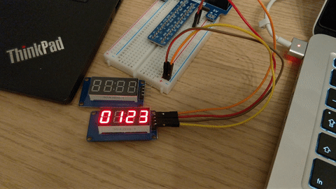

# Generic TM1637 GPIO Driver

Zero-dependency generic GPIO driver for the TM1637 micro controller. It is used in the
4-digit 7-segment display by AZ-Delivery [(Link)](https://www.az-delivery.de/products/4-digit-display).
Generic means that it is not dependent on a specific GPIO interface. You can choose the GPIO 
interface/library on your own. Also it uses no std-lib so it can be used in embedded systems.

This driver could/should work with other displays too if they use a TM1637 micro controller with the same
I2C-like serial bus protocol specified in the [data sheet](https://www.mcielectronics.cl/website_MCI/static/documents/Datasheet_TM1637.pdf).

I created this library/driver for fun and to learn new things!

See this demo (gif) I made with my Raspberry Pi using regular GPIO pins:

 
## How does this work? How do I write a driver for that thing?
This was my first time writing a (super simple basic) kind of a device driver.
As of now I'm not that much experienced with micro controllers.
After some time I understood how it works by looking at the [data sheet](https://www.mcielectronics.cl/website_MCI/static/documents/Datasheet_TM1637.pdf 
). Have a look into my code. I tried to make as many comments as possible.

## How can I use it?
My driver/library is not dependent on a specific GPIO interface.
You can use [crates.io: wiringpi](https://crates.io/crates/wiringpi) or [crates.io: gpio](https://crates.io/crates/gpio)
for example. I tested both on my Raspberry Pi. My `TM1637Adapter` needs functions/closures 
as parameters. These functions are wrappers to write High/Low to the desired Pins.

## Does this work only on Raspberry Pi?
Probably no! Although I can't test it because I don't have an Arduino or another similar device
this should work on every device where you can write a Rust program for. Since this lib
uses no standard library this should work on embedded devices. If you use it let me know
what things you've built!

But yes, it was only tested using regular GPIO pins on my Raspberry Pi running Rasbperry Pi OS so far.
 
### Who Am I?
I'm Philipp :)
Feel free to contribute on [Github](https://github.com/phip1611/generic-tm1637-gpio-driver-rust), write me an Email (phip1611@gmail.com) or
message me on Twitter (https://twitter.com/phip1611)!
 
### Special thanks
Special thanks to https://github.com/avishorp/TM1637. His driver for the Arduino platform
helped me to understand how the TM1637 micro controller works. With his work and my
effort I put into understanding the data sheet I could make this driver.
I also learned a lot about serial data transfer and the I2C-like serial bus protocol used by
the TM1637.

I don't use any of his code directly. It just gave me some inspiration.

### Trivia
- There is another library on crates.io for the TM1637: https://github.com/igelbox/tm1637-rs
It uses the "embedded-hal"-crate and takes another approach. Check this out too. :)

- I don't know if "driver" is the right word for this because it is not tied to the operating system.
  But the display is a device and my library can talk with it .. so yes.. basically a driver, right?
